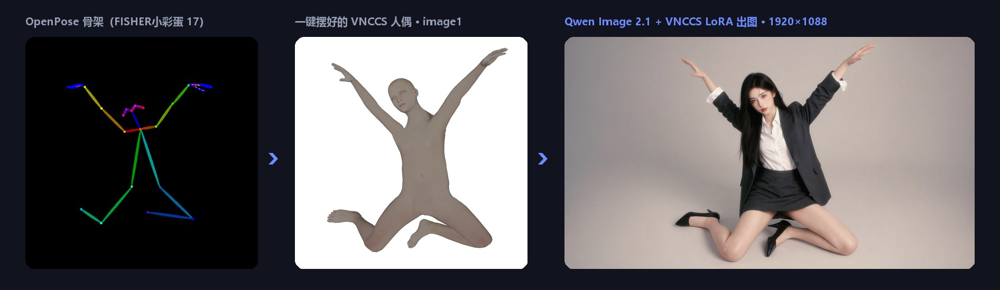
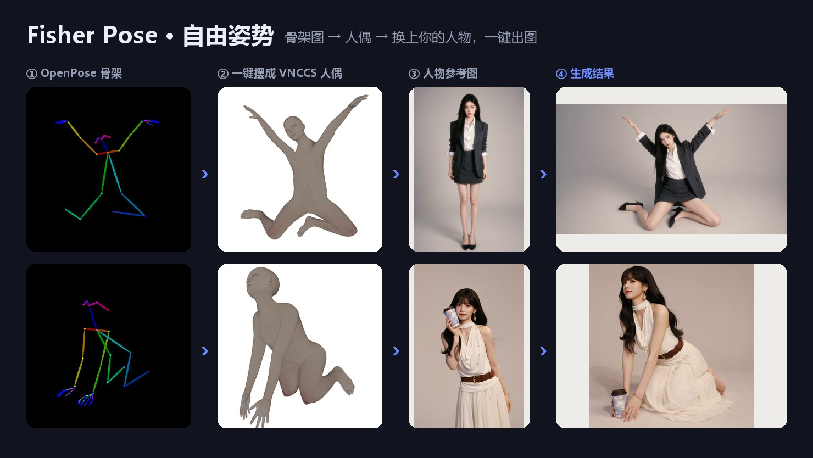
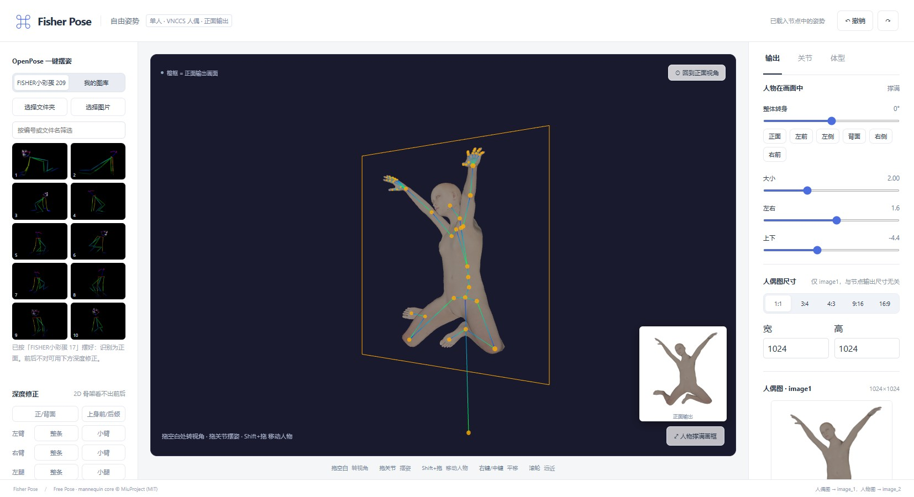

<div align="center">

# Fisher Pose · 机位与姿态

**给 Qwen Image 2.1 用的姿势与机位编辑插件：拖一拖 3D 人偶，或者点一张 OpenPose 骨架图，人物就摆成你要的样子。**

*A ComfyUI pose & camera studio for Qwen Image 2.1 — pose a 3D mannequin (or pick an OpenPose skeleton) and redraw your character in that pose.*




</div>

## 能做什么

| 模式 | 节点 | 一句话 |
|---|---|---|
| **自由姿势** | `Fisher Qwen2.1 自由姿势` | 单人任意摆姿：真人比例 3D 人偶 + VNCCS PoseStudio LoRA，把参考图里的人物重画成新姿势 |
| **自由视角** | `Fisher Qwen2.1 人物与姿态编码` | 1–3 人共用机位：转镜头、改站位与动作，中文编辑指令，可接 PE 扩写（[详细说明](docs/自由视角详细说明.md)） |

### 自由姿势亮点

- **真人比例人偶**：采用 [VNCCS Pose Studio](https://github.com/AHEKOT/ComfyUI_VNCCS_Utils) 的 MakeHuman 人偶，和 LoRA 训练时用的人偶一致，模型认得出。
- **OpenPose 一键摆姿**：点一张彩色骨架图就能摆好。2D 骨架没有前后信息，插件按骨长缩短量推算深度；估错时，躯干和四肢各段都能一键在前后之间翻转。
- **FISHER小彩蛋**：内置 209 张骨架图，涵盖站、坐、跪、蹲、躺、劈叉、悬空等姿势，打开就能点。
- **我的图库**：自己的骨架图选一次就会保存下来，下次打开自动载入。
- **自由视角编辑，正面输出**：拖空白处随意转视角、拖关节摆姿（手、脚、髋部可 IK）、Shift+拖动移动人物；输出固定为 VNCCS 的正面相机。
- **手势预设**：张开、并拢、握拳，外加握紧程度滑杆。
- **两个尺寸互不影响**：人偶图尺寸在编辑器里设；输出尺寸由节点的 width/height 决定，可以直接接分辨率节点。
- **应用即预览**：点「应用到节点」后，人偶图立刻显示在节点上，不用先跑一遍工作流。

## 效果



<sub>示例人物图为 AI 生成。人偶图是 image1，人物图是 image2，提示词固定为 `Draw character from image2`。</sub>

## 编辑器



- **左侧**：FISHER小彩蛋 / 我的图库、深度修正、手势。
- **中间**：3D 视口。橙色框是输出画面，右下角小图是实际的正面输出。
- **右侧**：人物在画面中的大小、位置和转身，人偶图尺寸，关节微调，体型。

## 安装

```bash
cd ComfyUI/custom_nodes
git clone https://github.com/Work-Fisher/ComfyUI-Fisher-Pose.git
```

装好后重启 ComfyUI 并刷新浏览器。插件不需要额外安装 Python 依赖，节点搜 `Fisher` 就能找到。

**自由姿势需要的模型：**

| 文件 | 放到 | 说明 |
|---|---|---|
| `qwen_image_2.1_*.safetensors` | `models/diffusion_models` | Qwen Image 2.1 主模型 |
| `qwen3vl_8b_*.safetensors` | `models/text_encoders` | 类型选 `qwen_image` |
| `qwen_image_2.1_vae_*.safetensors` | `models/vae` | |
| `VNCCS_QI2_PoseStudioV1.1.safetensors` | `models/loras` | **必需**，强度 1。下载：[MIUProject/VNCCS_PoseStudio_QI2.1](https://huggingface.co/MIUProject/VNCCS_PoseStudio_QI2.1) |

ComfyUI 需要是带 `TextEncodeQwenImage21` 节点的新版本。

## 快速上手（自由姿势）

1. 拖入 `workflows/Fisher-Qwen2.1-自由姿势-VNCCS-LoRA.json`，在「人物图 → image2」节点里选你的人物照片。
2. 点节点上的 **「打开自由姿势编辑器」**，在左侧 FISHER小彩蛋 里点一张骨架图，或者自己拖关节摆姿势。
3. 需要时用「深度修正」翻转前后、调整手势和人物大小，然后点 **「应用到节点」**。
4. 设置输出宽高，点运行。推荐参数：25 步、cfg 1、euler / simple，和 VNCCS 官方一致。

> `extra_prompt` 会另起一行附在固定指令后面，建议写英文，例如 `soft studio light`。

## 致谢

这个插件的自由姿势模式建立在以下开源工作之上，感谢各位作者的付出：

- **[VNCCS Utils](https://github.com/AHEKOT/ComfyUI_VNCCS_Utils) · [MiuProject / AHEKOT](https://github.com/AHEKOT)**：提供了 Pose Studio 人偶核心（`PoseViewerCore`、IK、截图）、MakeHuman 人体包加载、手部预设，以及 **[VNCCS PoseStudio QI2.1 LoRA](https://huggingface.co/MIUProject/VNCCS_PoseStudio_QI2.1)** 和它的训练约定（人偶 = image1，人物 = image2，`Draw character from image2`）。如果没有这套人偶和 LoRA，就没有这个自由姿势模式。代码以 MIT 许可随本仓库分发于 `web/vnccs/`，改动说明见该目录的 README。欢迎去原仓库点个星。
- **[MakeHuman](http://www.makehumancommunity.org/)**：人体网格与形体数据（CC0 1.0）。
- **[Qwen Image 2.1](https://github.com/QwenLM/Qwen-Image-2.1)**：生图模型，以及 [prompt_rewrite](https://github.com/QwenLM/Qwen-Image-2.1/tree/main/prompt_rewrite) 编辑指令规范（用于自由视角模式）。
- **[three.js](https://threejs.org/)**：3D 渲染（MIT）。
- **[ControlNet](https://github.com/lllyasviel/ControlNet)**：OpenPose 骨架的配色与连接顺序参考。
- **[ComfyUI-qwenmultiangle](https://github.com/jtydhr88/ComfyUI-qwenmultiangle)**：视角分档与镜头词汇参考。
- **[ComfyUI](https://github.com/comfyanonymous/ComfyUI)**：插件运行的平台。

## 许可

- 本插件代码：[MIT](LICENSE)。
- `web/vnccs/`：VNCCS Utils（MIT, © 2025 MiuProject）；MakeHuman 人体包（CC0 1.0）；three.js（MIT）。
- `web/editor/vendor/`：three.js（MIT）。
- 使用 LoRA 和基础模型时，请遵守它们各自的许可。

## 已知限制

- 自由姿势目前只支持单人。OpenPose 图里有多人时，只取身形最大的那个人。
- 2D 骨架无法唯一确定前后深度，复杂姿势需要手动翻转或微调。头部朝向、手指、脚掌不会从骨架读取。
- 人偶图只提供姿势。输出比例和人偶图差别很大时，人物在画面里的位置由模型决定。

---

更多：[自由视角模式详细说明](docs/自由视角详细说明.md)
