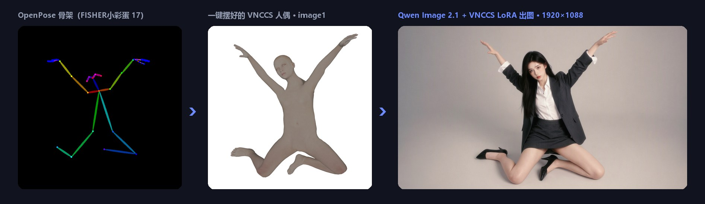
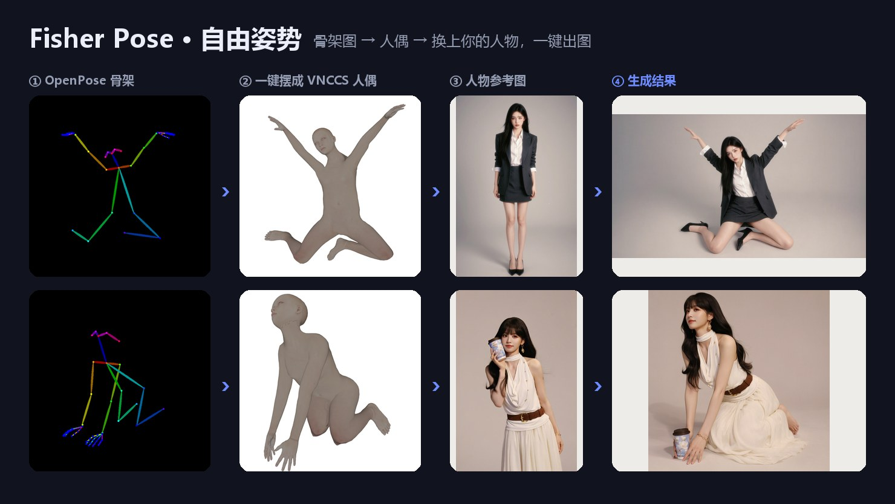
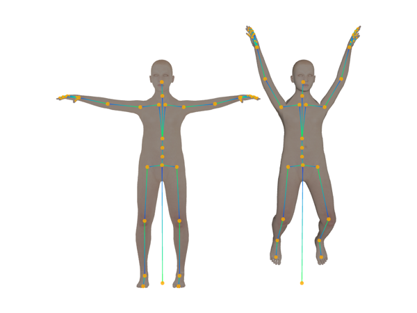
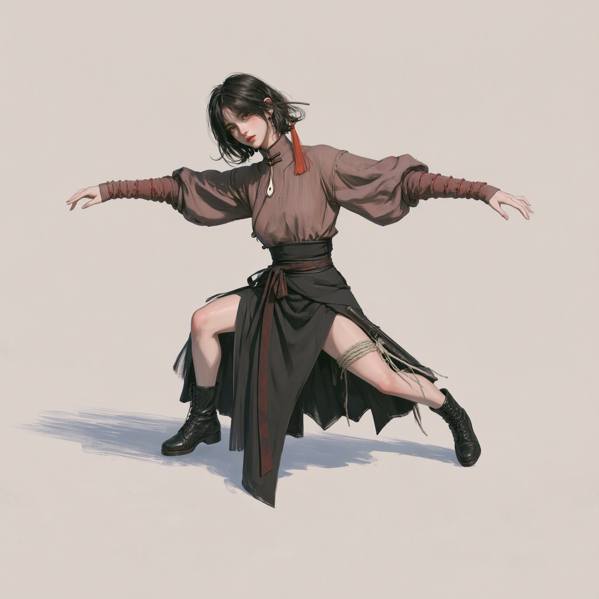
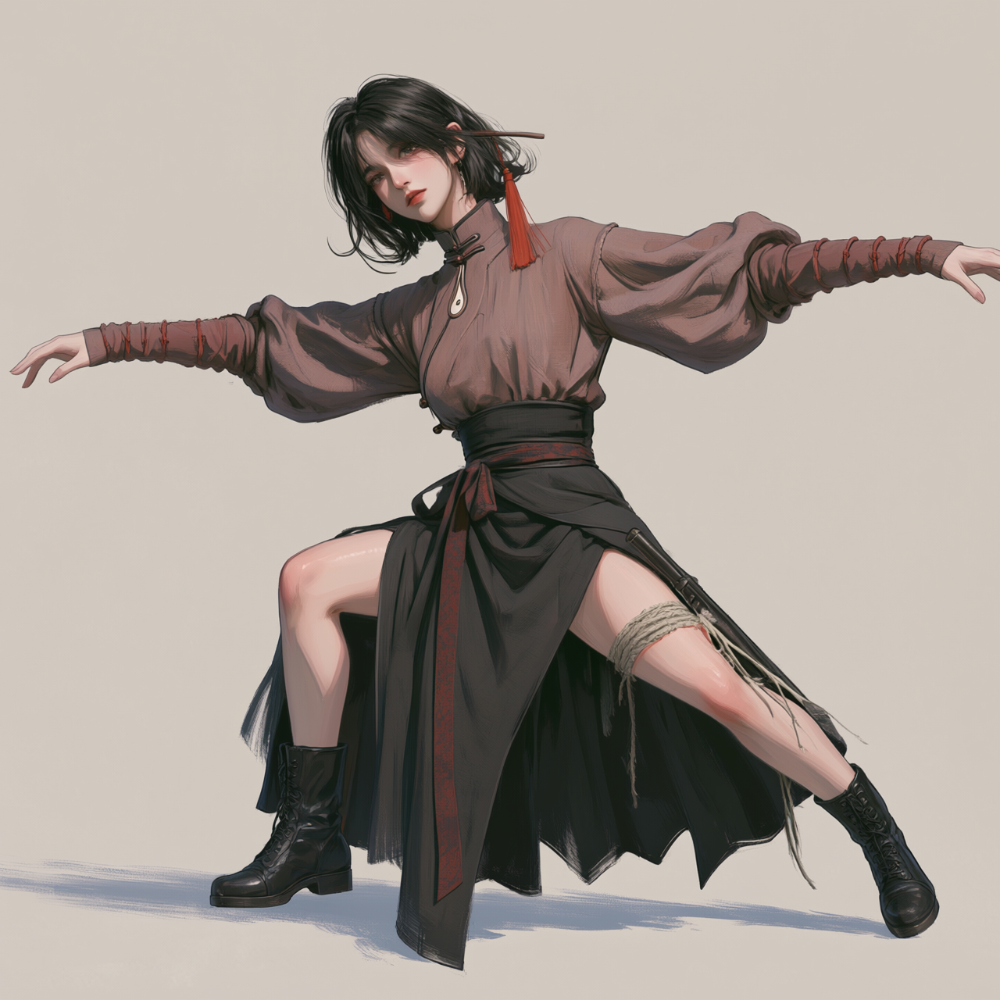
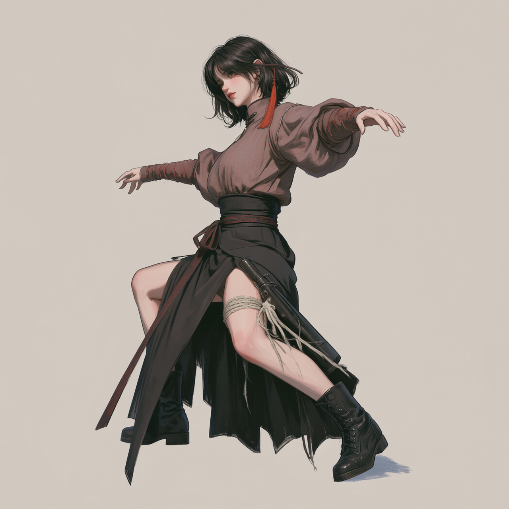
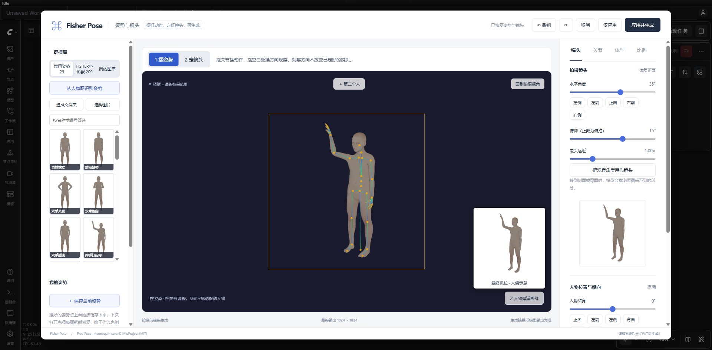

# Fisher Pose

**摆好姿势，定好镜头。**

在 ComfyUI 中编辑单人或双人姿势，用 Qwen Image 2.1 生成对应画面。

[下载插件](https://github.com/Work-Fisher/ComfyUI-Fisher-Pose/archive/refs/heads/main.zip) · [下载工作流](https://raw.githubusercontent.com/Work-Fisher/ComfyUI-Fisher-Pose/main/workflows/Fisher-Pose-Studio.json)

[安装与模型](docs/installation.md) · [使用指南](docs/usage.md)

## 演示

https://github.com/user-attachments/assets/24dc201a-d9dc-4ac7-86a8-acc9d8f6dd7c

自由姿势演示。双人与新机位的生成案例见下方。

## 从姿势到画面

### 单人 · 骨架、人偶与成图

选择骨架或直接拖动人偶关节，再用人物照片生成对应姿势。

展开完整对比：骨架、人偶、人物参考与生成结果

### 双人 · 一张合照，分别摆姿

上传完整合照，在编辑器添加第二个人。两个人偶可以分别调整动作；人物对应可在右侧交换。

<table>
<tr>
<th width="30%">人物合照</th>
<th width="30%">双人姿势</th>
<th width="40%">生成结果</th>
</tr>
<tr>
<td align="center"></td>
<td align="center"></td>
<td align="center"></td>
</tr>
</table>

完整合照输入，不需要手动裁切。身份对应依赖模型理解，复杂遮挡与细微动作仍可能需要调整。

### 多视角 · 同一姿势，改变镜头

先生成正面姿势，再通过 AnyAngle 换机位。下方标签表示编辑器设定的镜头角度。

<table>
<tr><th width="33%">正面</th><th width="33%">右侧 45°</th><th width="33%">右侧 90°</th></tr>
<tr>
<td></td>
<td></td>
<td></td>
</tr>
</table>

实际生成结果；镜头与姿势跟随不保证逐像素一致，背面及遮挡部分由模型推测。换机位需要额外模型。

## 三步上手

| 1 · 选人物 | 2 · 摆姿势、定镜头 | 3 · 应用并生成 |
|---|---|---|
| 选择单人照片或完整合照 | 选预设、拖关节；需要时切到「定镜头」 | 查看机位预览，再运行生成 |

先按 [安装指南](docs/installation.md) 准备环境，导入唯一的最新版工作流 [Fisher-Pose-Studio.json](workflows/Fisher-Pose-Studio.json)。

- **正面出图**：只需要基础模型，自动跳过换机位分支。
- **只改镜头**：复用上一次正面结果与 3D 重建。
- **再生成一张**：姿势与镜头不变，再点「应用并生成」会更新正面种子。

查看编辑器布局与操作说明

左侧选姿势，中间编辑人偶，右侧调整镜头、关节、体型和比例。摆姿势时拖空白处观察，不会改变已设定的拍摄镜头。

[完整操作说明](docs/usage.md)

## 功能一览

| 姿势编辑 | 镜头与构图 | 素材与复用 |
|---|---|---|
| 单人 / 双人独立调整 | 正面、侧面、俯视、仰视 | 29 个常用姿势 |
| 拖关节、调手势与身体比例 | 编辑观察与拍摄机位分离 | 209 张内置骨架 |
| 照片 → 骨骼预览 → 应用姿势 | 自动撑满、镜头远近与平移 | 保存姿势与个人图库 |
| 默认开启骨骼参考 | 参考图尺寸与输出尺寸独立 | 应用即显示人偶预览 |

照片识别需要可选的 DWPose 插件与权重。[依赖与下载](docs/installation.md#照片识别姿势可选)

## 安装与下载

| 你要做什么 | 从这里开始 |
|---|---|
| 第一次安装 | [安装插件与环境](docs/installation.md#安装与依赖插件) |
| 单人或双人摆姿出图 | [4 个基础模型：下载与放置目录](docs/installation.md#基础生图模型单人双人都需要) |
| 生成新的镜头角度 | [追加 6 个机位模型](docs/installation.md#换机位追加模型) |
| 上传照片识别姿势 | [识别插件与 2 个检测权重](docs/installation.md#照片识别姿势可选) |
| 从旧版本升级 | [需要更新什么、哪些模型可以复用](docs/installation.md#老用户升级需要重新下载什么) |

**老用户注意：更新插件后重新导入新版工作流，重启 ComfyUI 并刷新浏览器。** 已有且完整的同版本模型无需重复下载。

[常见问题](docs/usage.md#常见问题) · [已知限制](docs/usage.md#已知限制) · [原自由视角模式](docs/自由视角详细说明.md)

## 致谢

这个插件的自由姿势模式建立在以下开源工作之上，感谢各位作者的付出：

- **[VNCCS Utils](https://github.com/AHEKOT/ComfyUI_VNCCS_Utils) · [MiuProject / AHEKOT](https://github.com/AHEKOT)**：提供了 Pose Studio 人偶核心（`PoseViewerCore`、IK、截图）、MakeHuman 人体包加载、手部预设，以及 **[VNCCS PoseStudio QI2.1 LoRA](https://huggingface.co/MIUProject/VNCCS_PoseStudio_QI2.1)** 和它的训练约定（人偶 = image1，人物 = image2，`Draw character from image2`）。如果没有这套人偶和 LoRA，就没有这个自由姿势模式。代码以 MIT 许可随本仓库分发于 `web/vnccs/`，改动说明见该目录的 README。欢迎去原仓库点个星。
- **[MakeHuman](http://www.makehumancommunity.org/)**：人体网格与形体数据（CC0 1.0）。
- **[Qwen Image 2.1](https://github.com/QwenLM/Qwen-Image-2.1)**：生图模型，以及 [prompt_rewrite](https://github.com/QwenLM/Qwen-Image-2.1/tree/main/prompt_rewrite) 编辑指令规范（用于自由视角模式）。
- **[three.js](https://threejs.org/)**：3D 渲染（MIT）。
- **[ControlNet](https://github.com/lllyasviel/ControlNet)**：OpenPose 骨架的配色与连接顺序参考。
- **[ComfyUI-qwenmultiangle](https://github.com/jtydhr88/ComfyUI-qwenmultiangle)**：视角分档与镜头词汇参考。
- **[QI 2.1 AnyAngle](https://huggingface.co/lilylilith/QI_2.1_AnyAngle) · lilylilith**：换机位 LoRA；**[TripoSplat](https://github.com/VAST-AI-Research/TripoSplat) · VAST**：单图生成 3D 高斯溅射；**[AnyAngle Studio · T8](https://github.com/T8mars/Comfyui-Qwen-Image-2.1-MultiAngle-T8)**：AnyAngle 图片顺序与用法的参考。
- **[ComfyUI](https://github.com/comfyanonymous/ComfyUI)**：插件运行的平台。

许可说明

## 许可

- 本插件代码：[MIT](LICENSE)。
- `web/vnccs/`：VNCCS Utils（MIT, © 2025 MiuProject）；MakeHuman 人体包（CC0 1.0）；three.js（MIT）。
- `web/editor/vendor/`：three.js（MIT）。
- 使用 LoRA 和基础模型时，请遵守它们各自的许可。

